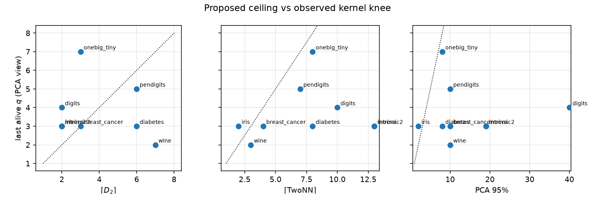
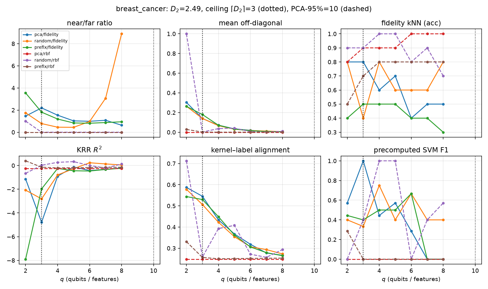
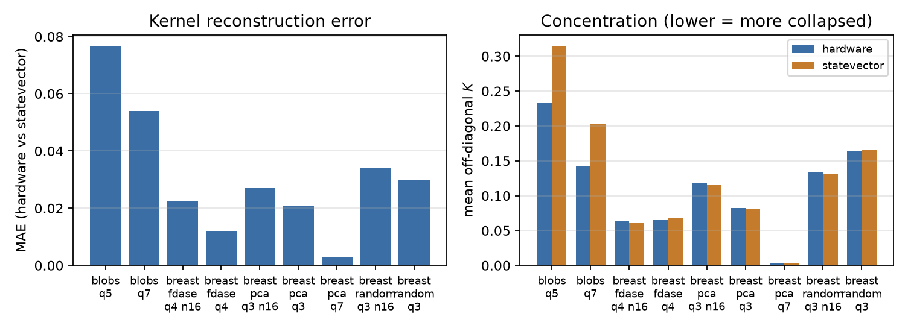

# Intrinsic dimension, fractal dimension, and feature choice in QML

Research note. The question is **not** whether QSVM beats SVM: on classical tabular data the SVM usually wins, and that is already in the literature. The question is **quantum against quantum**:

> For the same QML model (QSVM, fidelity kNN, VQC, …), is it better to encode the attributes selected by fractal dimension than to encode every attribute, the leading PCA components, or some other classical feature selector?

What this line evaluates is the geometry: \(D_2\) (how many qubits) and FD-ASE (which original columns). The row sample is uniform.

## 1. Embedding dimension versus intrinsic dimension

A tabular data set is a cloud of \(N\) points in \(\mathbb{R}^{E}\). \(E\) is the **embedding dimension** (ambient dimension): the number of recorded attributes. It is almost never the number of degrees of freedom the cloud actually has.

**Intrinsic dimension** (ID) is that number of degrees of freedom: the dimension of the support, the manifold, or the fractal set the data live on.

Three pictures:

1. **A circle in 20-D.** Two axes carry \((\cos t, \sin t)\); the other 18 are noise. \(E=20\), but a single parameter \(t\) describes the signal. The ID is \(\approx 1\), not 20 and not 2 (the circle does not fill the disk).
2. **A plane in 100-D.** Two independent linear axes, the rest constant or noise. ID \(= 2\). Here PCA and ID agree, because the support *is* a linear subspace.
3. **A Swiss roll.** A 2-D sheet rolled up in 3-D. The ID is 2, but PCA needs **three** components to explain the cloud in ambient space: the roll is nonlinear. Linear variance \(\neq\) dimension of the support.

In QML with *angle encoding*, each attribute (or each PC) typically becomes **one qubit** [havlicek2019supervised, schuld2019quantum]. Encoding \(E\) encodes the ambient dimension. The circuit does not “know” that 18 axes are noise: it treats them as real coordinates, and the fidelity kernel feels the dimension **in which states are prepared**, not the ID.

So ID is not a geometric aside. It is the budget: if the support has ID \(\approx d\), preparing states on \(q \gg d\) qubits asks the map for a dimension the data do not have.

### 1.1 What ID is not

- **Not the number of classes.** Breast cancer has 2 classes and ID of order 2–4; digits has 10 classes and a much richer image support.
- **Not the rank of the covariance matrix**, except when the support is a linear subspace. Rank and PCA-95% measure *linear* scatter.
- **Not necessarily an integer.** Self-similar sets (Cantor dust, some cluster mixtures) have fractional ID. Fractal dimension is the tool that allows that.

## 2. Correlation fractal dimension \(D_2\)

There are many dimension definitions (Hausdorff, box-counting \(D_0\), information \(D_1\), correlation \(D_2\), …). For point clouds in data mining, the one that can be estimated stably is the **correlation fractal dimension** \(D_2\) [belussi1995estimating, grassberger1983characterization].

Intuition: count pairs of points that fall in the same cell of a grid of side \(r\). If the support behaves like a set of dimension \(d\), that count scales as a power of \(r\):

\[
S(r) \;=\; \sum_{\text{cells } i} C_i(r)^{2} \;\propto\; r^{D_2}.
\]

\(C_i(r)\) is the occupancy of cell \(i\). In log-log coordinates,

\[
D_2 \;=\; \frac{\mathrm{d}\,\log S(r)}{\mathrm{d}\,\log r}.
\]

That is the slope of the plot LiBOC already drew [traina2000fast]. Scales at which every point sits alone in its cell (\(S \approx N\)) are dropped from the fit: there the grid only sees dust, not the support.

Properties that matter for QML:

- **\(D_2 \le E\)** always. Equality only if the cloud fills the ambient cube.
- **Invariant to redundant axes.** If column 7 is a multiple of column 2, \(D_2\) barely rises when 7 is included. That is exactly the FD-ASE test.
- **Multiscale.** The fit uses several \(r\). That is why \(D_2\) is slower to be fooled by *local* noise than a nearest-neighbour estimator (TwoNN [facco2017estimating] sees geometry at the scale of \(r_1, r_2\); if embedding noise is of that order, it inflates ID).
- **No labels and no circuit.** It is computed classically, once, on a large subset (hundreds or thousands of points — not on the \(n=32\) of a NISQ kernel).

The estimator is the LiBOC box-count: normalise to the unit cube, build the multi-resolution grid, and estimate the slope on the self-similar range.

### 2.1 Two numbers, two jobs: *how many* and *which*

\(D_2\) answers **how many** degrees of freedom the support has. It does not choose coordinates.

**FD-ASE** [sousa2002fractal] (the same algorithm as the SAC 2007 poster) answers **which** original attributes suffice to recover that \(D_2\):

1. drop constants (partial dimension \(\approx 0\));
2. add the attribute that most increases the partial dimension \(pD\);
3. stop when \(pD\) stops rising (the new axis is correlated with those already chosen);
4. return the set \(E_s\), with \(\lvert E_s\rvert \approx D_2\).

The contrast with PCA is sharp at encoding time:

| | PCA | FD-ASE |
|---|---|---|
| Returns | linear mixtures of **all** axes | a **subset** of the original columns |
| Criterion | variance | growth of \(D_2\) |
| One qubit encodes | a PC (junk mixed into the signal) | an attribute that still increases ID |
| \(k\) | hyperparameter (95% variance, or 4–16) | \(\lceil D_2\rceil\) comes from the geometry |

PCA is **not** an ID estimator. It is a linear variance cut. It can ask for 19 components on a 1-D circle embedded in 20-D, because standardisation turns noise into unit variance. The fractal, on the same set, still sees \(D_2 \approx 1\).

## 3. Why this belongs in QML (and why we do not compare to classical)

Angle encoding / `ZZFeatureMap`: one qubit per coordinate. The fidelity kernel is

\[
K_{ij} \;=\; \bigl|\langle \psi(x_i) \mid \psi(x_j) \rangle\bigr|^{2}.
\]

In high dimension the states become nearly orthogonal: off-diagonals concentrate at 0 and the method stops seeing geometry [huang2021power, thanasilp2024exponential]. That holds for **any** task that drinks this \(K\) — QSVM, quantum kNN, spectral clustering on the kernel, one-class, kernel ridge, and the encoding block of a VQC [schuld2021supervised]. It is not a “the classical classifier is better” problem. It is a **state-preparation** problem.

NISQ practice reduces \(E\) until it fits the hardware: PCA, autoencoder, manual selection [belis2025learning]. The \(k\) is a hyperparameter validated *after* the QSVM. Nobody we have found uses \(D_2\) as an *a priori* budget, or FD-ASE as a selector whose rival is PCA **inside the same quantum model**.

The claim, in one sentence:

> \(\lceil D_2\rceil\) says how many qubits the feature map can still bear; FD-ASE says which original attributes to use. In the same QML model, that should be better (kernel *alive*, \(K\)-dependent tasks not degenerate) than encoding every attribute, PCA-95%, or \(k\) random axes.

What the claim is **not**:

- QSVM vs SVM (classical vs quantum).
- Amplitude encoding (\(\lceil\log_2 E\rceil\) qubits): a different count; \(D_2\) does not shorten state preparation.
- Projected kernels or Bit-Flip Tolerance [huang2021power, agliardi2025mitigating]: they change *how* \(K\) is evaluated, not *which* coordinates are encoded.

## 4. Protocol: the same quantum model, different feature views

Implementation: [`qml/qubit_budget.py`](../qml/qubit_budget.py), [`qml/features.py`](../qml/features.py) (FD-ASE, PCA, prefix, random), CLI [`qml/run_qubit_budget.py`](../qml/run_qubit_budget.py).

Comparisons, all on the **same** fidelity kernel (statevector simulator, extra `qml`):

| View | What the QML model sees |
|---|---|
| **FD-ASE** | columns \(E_s\), \(q=\lvert E_s\rvert \approx \lceil D_2\rceil\) |
| **PCA** | first \(q\) PCs, with \(q\) swept and also \(q\) from PCA-95% |
| **prefix / full** | the first (or all) coordinates, up to the hardware cap |
| **random** | \(q\) columns at random (selection baseline) |

The judge is not “accuracy against SVM”. It is whether the quantum \(K\) still distinguishes geometry (*kernel alive*: near \(\ge 0.25\), near/far ratio \(\ge 2\), mean off-diagonal \(\ge 0.03\)) and the **quantum** tasks that share \(K\):

| layer | what ran |
|---|---|
| Feature maps | \(ZZ\) on the simulator (sweep) and on IBM; dense-angle and re-uploading **simulator only** (\(n=32\); breast, moons, pendigits) |
| Kernel | fidelity \(K_{ij}=\lvert\langle\psi(x_i)\mid\psi(x_j)\rangle\rvert^{2}\) |
| QML on \(K\) (simulator, \(n=32\)) | precomputed SVM (QSVM-style), fidelity kNN, spectral clustering, one-class SVM, KRR |
| Control | classical RBF on the **same** \(q\) coordinates |
| Hardware | the \(ZZ\) kernel only (\(n=8\)); classifiers do not run on the QPU |
| Not used | trained VQC, QSVM vs SVM as the question |

**Fewer qubits \(\neq\) fewer points.** \(\lceil D_2\rceil\) cuts coordinates in the map. IBM \(n=8\) cuts rows because each pair is a circuit. The claim is the first cut. We do not claim a smaller sample is better.

RBF in the CSV is only a diagnostic: if it lives while fidelity dies, the collapse is of the feature map.

\(D_2\), TwoNN and PCA-95% are estimated on a large classical subset (up to 4000 points), not on the kernel’s \(n=32\).

```bash
python d2-qubit-budget/qml/run_qubit_budget.py
python d2-qubit-budget/qml/run_qubit_budget.py --fast
```

## 5. What the numbers show (simulator, \(n=32\))

Read this as **quantum–quantum**. The *alive* column is the last \(q\) on the PCA/fidelity curve. PCA-95% is the \(q\) QML practice would pick. \(\lceil D_2\rceil\) is the \(q\) the fractal picks.

| data set | \(E\) | \(D_2\) | \(\lceil D_2\rceil\) | PCA-95% | alive (fidelity) |
|---|---:|---:|---:|---:|---:|
| intrinsic2 | 20 | 0.72 | 2 | 19 | 3 |
| moons | 20 | 0.72 | 2 | 19 | 3 |
| iris | 4 | 1.92 | 2 | 2 | 3 |
| breast | 30 | 2.49 | 3 | 10 | **3** |
| diabetes | 10 | 5.82 | 6 | 8 | 3 |
| wine | 13 | 6.48 | 7 | 10 | 2 |
| digits | 64 | 0.91 | 2 | 40 | 4 |
| pendigits | 16 | 5.35 | 6 | 10 | 5 |
| onebig | 8 | 2.27 | 3 | 8 | 7 |

- **Encoding “as in QML-practice PCA” kills the kernel** where the fractal keeps it alive. Breast: PCA-95% asks for 10 qubits; fidelity has already collapsed at \(q=4\). Moons/intrinsic2: PCA asks for 19; the angle map lives at 2–3.
- **Encoding every attribute** (or a prefix up to 8) is the same mistake when \(E\) is large: that is ambient dimension, not ID.
- **Pendigits** (\(E=16\), \(D_2\approx 5.4\)): the fidelity knee sits at 5, next to the fractal ceiling 6, not at 10 (PCA) or 16 (all).
- **Random axes** do not replace FD-ASE: on breast the random/fidelity curve does not sustain the *alive* criterion.
- Honest failures: OneBig (trivial clusters, the kernel lives past \(\lceil D_2\rceil\)); wine/diabetes (high ID, \(n=32\) concentrates *before* the ceiling); digits (\(E=64\), box-count on the floor — do not trust LiBOC when \(E \gg \log N\)).



*How to read the figure.* A point on the \(y=x\) diagonal means the proposed ceiling matches the last \(q\) at which the fidelity kernel is still alive. Left: \(\lceil D_2\rceil\) tracks that knee (breast at \(3\); pendigits \(6\) vs \(5\)). Centre: TwoNN inflates moons/intrinsic2. Right: PCA-95% asks for \(10\)–\(40\) qubits after the kernel has already died at \(q\le 5\) — that panel has its own \(x\)-axis so the live knees (\(2\)–\(7\)) stay visible.

### 5.1 Breast: the same QSVM, fractal \(q\) vs PCA \(q\)

\(E=30\), \(D_2\approx 2.49\), \(\lceil D_2\rceil=3\), PCA-95%=10. Fidelity kernel, PCA view (this \(n=32\) draw):

| q | alive? | mean \(K\) | near / far |
|---|---|---|---|
| 2 | no (ratio \(<2\)) | 0.30 | 0.49 / 0.34 |
| **3 = ⌈D2⌉** | **yes** | 0.14 | 0.27 / 0.12 |
| 4 | no | 0.07 | 0.11 / 0.07 |
| 8 | no | 0.00 | 0.00 / 0.01 |

QSVM F1 at \(n=32\) jumps around; concentration does not. Encoding 10 PCs, on this map, is encoding a kernel that is already diagonal.



*How to read the figure.* Grey dashed vertical: PCA-95% (\(q=10\)). Dotted: fractal ceiling (\(q=3\)). Solid = fidelity kernel (the QML object); dashed = classical RBF on the same coordinates. Fidelity mean off-diagonals fall toward \(0\) as \(q\) grows; RBF does not — the collapse is the angle map. For `pca/fidelity`, kNN and SVM F1 peak at \(q=3\) and worsen after. Encoding \(3\) PCs (fractal width) leaves QSVM/kNN with a live \(K\); encoding \(10\), as PCA practice would, feeds those same algorithms a kernel that is already diagonal.

Figures for the other data sets: `docs/figures/qubit-budget/` (English axis labels).

## 6. More than one attribute per qubit

$\lceil D_2\rceil$ budgets *Hilbert-space width* (how many qubits), not a one-attribute-per-qubit law. Dense-angle ($RY$+$RZ$ per qubit) and data re-uploading [perezsalinas2020data] keep the kernel alive at the fractal $q$ while packing two PCA coordinates per qubit. Packing toward the PCA-95% cut onto *that same* $q$ (12 PCs on 3 breast qubits; 16 PCs on 2 moons qubits) kills or inverts near/far geometry.

**Verdict for encodings:** on the simulator, yes — working at the fractal width is better than encoding the PCA-95% (or full \(E\)) width; you cannot recover that extra width by stacking it onto \(\lceil D_2\rceil\) qubits. Dense-angle and re-uploading **were** tested (simulator, \(n=32\)). IBM ran the \(ZZ\) map only.

## 7. Hardware (`ibm_fez`, 30 August 2026)

Six Sampler jobs, 256 shots, $n=8$ (28 compute–uncompute circuits), linear entanglement, `reps=1`. Matrices in [`docs/hardware/`](hardware/).

| job | $q$ | MAE vs SV | mean $K$ HW | mean $K$ SV |
|---|---:|---:|---:|---:|
| blobs | 5 | 0.077 | 0.234 | 0.315 |
| blobs | 7 | 0.054 | 0.142 | 0.202 |
| breast PCA | **3 = ⌈D2⌉** | **0.021** | **0.082** | **0.081** |
| breast PCA | 7 | 0.003 | 0.004 | 0.003 |
| breast FD-ASE (cols. 27, 21, 9, 8) | 4 | **0.012** | 0.065 | 0.068 |
| breast random (cols. 15, 18, 23) | 3 | 0.030 | 0.164 | 0.166 |

At the PCA ceiling and on FD-ASE, hardware tracks the exact kernel (MAE $0.012$–$0.021$). At $q=7$ the simulator has already collapsed and the device agrees. The random control is not collapsed, but $n=8$ is too small for the near/far *alive* rule (PCA $q=3$ also fails it on this subsample — that rule was calibrated at $n=32$).



*How to read.* Left: the device implements the map (low MAE = faithful to the statevector). Right: at \(q=7\) both HW and SV bars sit on the floor — the collapse is already in the exact \(K\). FD-ASE (\(q=4\)) is the most faithful map (MAE \(0.012\)). Random is not collapsed, but \(n=8\) cannot decide near/far.

## 8. Other QML methods (always the same \(K\))

Anything that prepares \(\lvert\psi(x)\rangle\) by angles inherits the ceiling and the selector: VQCs, quantum kNN, distances in embeddings, reservoirs. Amplitude encoding and physical Hamiltonians whose degrees of freedom are not a tabular vector **do not** inherit it.

## 9. Limits

- Box-count \(D_2\) needs sample size and several scales; a few dozen points are not enough.
- FD-ASE selects original columns, not mixtures; if the signal *only* lives along an oblique direction, PCA may be the right selector — and the protocol must show that when it happens.
- The *alive* rule is operational, not a hypothesis test.
- Simulator, linear entanglement, `reps=1`. The knee should *track* $D_2$, not copy the value 3 on every circuit.
- Hardware: $n=8$, one backend, 256 shots, no error mitigation.

## 10. Conclusion

**Fewer qubits, yes.** For the same quantum model — \(ZZ\) map (simulator and IBM) or dense-angle / re-uploading (**simulator only**), fidelity kernel, then QSVM, fidelity kNN, spectral clustering, one-class SVM or KRR on that \(K\) — encoding at \(q=\lceil D_2\rceil\) keeps the kernel alive. Encoding the PCA-95% width or all \(E\) attributes feeds those same algorithms a kernel that has already collapsed (breast: live at \(3\), dead by \(4\)–\(10\); moons: live at \(2\)–\(3\), PCA would encode \(19\)). FD-ASE names the original columns of that width. On the simulator, two attributes per qubit still work at the fractal \(q\); pouring PCA-95% into those qubits does not.

**Fewer data points, no — that was not the test.** \(D_2\) is estimated on up to \(4000\) classical rows. The QML kernel uses \(n=32\) on the simulator and \(n=8\) on IBM only because each pair is a circuit. We do not claim a smaller sample is better. On the device, \(n=8\) is enough to see that \(q=3\) is faithful and \(q=7\) is already diagonal, not enough to rank FD-ASE against random columns.

LaTeX draft (PKDD/LNCS-like): [`paper/d2-qubit-budget.tex`](paper/d2-qubit-budget.tex).

## 11. Reproduction

```bash
python3 -m pip install -e ".[dev,qml]"
python3 d2-qubit-budget/qml/run_qubit_budget.py
python3 d2-qubit-budget/qml/run_packed_encoding.py
python3 d2-qubit-budget/qml/run_hardware_article.py   # IBM; writes docs/hardware/
python3 -m pytest -q d2-qubit-budget/tests
```

References: [`referencias.bib`](../../docs/referencias.bib). Portuguese version: [`d2-qubit-budget.md`](d2-qubit-budget.md).
